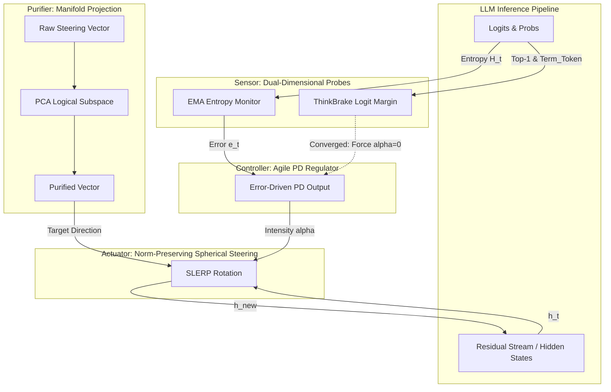

### 3. Methodology: Dynamic Closed-Loop Steering Framework

本节的开篇需要一个简短的宏观概述（Overview），将大模型的推理干预与自动控制系统（如 L4 级自动驾驶）建立物理隐喻。本框架由传感器（Sensor）、控制器（Controller）、纯化器（Purifier）和执行器（Actuator）四个高度解耦的模块协同构成。

#### 架构图 (Mermaid)

你可以使用以下 Mermaid 代码生成基础架构图，并在排版时进行视觉美化：

---

#### 3.1 Pilot Study & Motivation: The Lagging Effect Trap

* **撰写核心：** 阐述从“开环启发式试错”转向“底层闭环控制”的科学动机。
* **物理直觉：** 描述最初使用结构化输出（如 `<critic>` 标签）作为启发式门控触发器的尝试。
* **核心论点：** 实验揭示了严重的“滞后性陷阱（Lagging Effect Trap）”。由于大模型的自回归机制，当表层词法错误（如 `<critic>` 标签）被解码输出时，模型内部早期的上下文缓存（KV Cache）和残差状态流已被直觉谬误污染。此时的干预只能迫使模型在已腐败的逻辑上进行无效的过度思考（Overthinking）与事后自圆其说（Rationalization）。这一失败证实，必须深入物理底层寻找前置触发器。

#### 3.2 Sensor: High-Agility Dual-Dimensional Probes

* **撰写核心：** 确立物理指标的合法性，摒弃文本触发与高噪音的瞬时特征。
* **模块 1：Exponential Moving Average (EMA) Entropy**
    * 单点瞬时熵（$H_t$）在长思维链生成中存在极大噪音，而传统的累积平均具有“无限记忆包袱”，导致系统反应迟钝。
    * 本研究引入指数移动平均（EMA）赋予系统平滑遗忘机制。
    * 公式表达：$\text{EMA}_t = \beta \cdot H_t + (1 - \beta) \cdot \text{EMA}_{t-1}$。
* **模块 2：ThinkBrake Endogenous Convergence**
    * 为取代破坏语言连贯性的粗暴截断（Budget Forcing），引入基于模型内部置信度的预判机制。
    * 公式表达：$M_t = \log p(y_t^\star) - \log p(y_{\text{term}})$。
    * 当对数概率边际 $M_t \le \tau_{\text{threshold}}$ 时，触发硬性熔断锁存（Permanent Latch），强制干预强度归零，完美保护逻辑收敛。

#### 3.3 Controller: Agile PD Regulator Without Integral Windup

* **撰写核心：** 引入自动控制理论，严谨论证剔除 PID 中积分项的必要性。
* **核心论点：** 现有的干预方法采用静态的全局注入强度，缺乏自适应能力。大模型的生成序列具有不可逆性，经典 PID 算法中的积分项极易引发积分饱和（Integral Windup），导致干预力度被钉死。
* **公式推导：**
    * 定义物理误差：$e_t = \text{EMA}_t - \text{SetPoint}$。
    * 计算比例项与微分项：$P_t = K_p \cdot e_t$ ； $D_t = K_d \cdot (e_t - e_{t-1})$。
    * 最终输出强度钳制：$\alpha_t = \text{Clamp}(P_t + D_t, 0, \alpha_{\max})$。
    * 这一设计实现了真正的连续时间动态自适应：“一迷茫就介入，一清醒就撤出”。

#### 3.4 Purifier: PCA-Based Manifold Projection

* **撰写核心：** 从高维拓扑几何的角度消除向量噪声，确保干预的纯净度。
* **物理直觉：** 直接提取的原始引导向量充斥着“强制停止”等高维正交噪声，这是引发语义漂移的元凶。
* **数学实现：**
    * 离线对高阶模型的正常推理隐状态矩阵执行主成分分析（PCA）。
    * 提取前 $k$ 个正交基构建低维逻辑流形 $U_k = [u_1, u_2, \dots, u_k]$。
    * 将原始向量投影纯化：$v_{\text{purified}} = \sum_{i=1}^k (v_{\text{raw}} \cdot u_i) u_i$。

#### 3.5 Actuator: Norm-Preserving Spherical Steering

* **撰写核心：** 这是本系统的底层物理创新，彻底终结模型崩溃（状态休克）。
* **核心论点：** 严厉批判传统的线性加法（$h = h + \alpha v$）。线性操作会急剧改变隐状态向量的绝对模长（Norm），在深层网络中引发分布偏移与灾难性的状态休克（State Shock），表现为无休止的复读机死循环。
* **几何重构（球面线性插值 SLERP）：**
    * 提取方向：$\hat{h} = \frac{h}{||h||_2}$。
    * 计算夹角：$\theta = \arccos(\hat{h} \cdot v)$。
    * 势能注入缩短夹角：$\theta_{\text{new}} = (1 - \alpha_t) \cdot \theta$。
    * 构建二维正交基：$u = \frac{\hat{h} - \cos(\theta)v}{\sin(\theta)}$。
    * 执行旋转：$\hat{h}_{\text{rotated}} = \cos(\theta_{\text{new}})v + \sin(\theta_{\text{new}})u$。
    * **最关键的保范数操作：** $h_{\text{new}} = ||h||_2 \cdot \hat{h}_{\text{rotated}}$。此机制在注入动力的同时，绝对维持了向量模长不变。

根据我们确定的**“黎曼流形上的受限闭环动力学 (Constrained Closed-Loop Dynamics on Riemannian Manifolds)”**视角，

- **3.1 Theoretical Preliminaries & Unified Formulation**）。
- **3.2 High-Agility Dual-Dimensional Probes:** 详细写 EMA 的公式（解释为什么不用瞬时熵）和 ThinkBrake $M_t$ 的逻辑边际公式。
- **3.3 Agile PD Regulator Without Integral Windup:** 详细展开 $\alpha_t$ 的计算，重点论证为什么去掉积分项（防止积分饱和 / Integral Windup）。
- **3.4 PCA-Based Manifold Projection:** 写明如何通过 SVD/PCA 提取 $U_k$ 正交基并做投影纯化。
- **3.5 Norm-Preserving Spherical Steering:** 给出 SLERP 从 $\theta = \arccos(\hat{h} \cdot v)$ 到构建二维平面并旋转的完整数学推导，这是解决“状态休克”的杀手锏。

------

### 3. Methodology

#### 3.1 Theoretical Preliminaries: LLM Inference as a Controlled Dynamical System on Manifolds

The paradigm shift towards System-2 deliberate reasoning essentially expands the test-time compute of Large Language Models (LLMs), allowing them to generate explicit Chains-of-Thought (CoT) before yielding a final answer. However, unconstrained generation frequently causes models to fall into the "Overthinking Trap"—a cognitive local minimum where the model oscillates in high-entropy states, endlessly validating erroneous priors without achieving logical convergence.

Traditional Inference-Time Intervention (ITI) and continuous activation steering attempt to rectify this by injecting a fixed directional vector $v$ into the hidden states $h_t$ via linear addition ($h_{t+1} = h_t + \alpha v$). From a geometric perspective, since the hidden state space of modern LLMs is heavily constrained by normalization layers (e.g., RMSNorm), the valid latent representations reside on a high-dimensional hypersphere $\mathcal{M} = \mathbb{S}^{d-1}$. Simple linear addition inevitably pushes the hidden states off this pre-trained manifold, drastically altering the $L_2$ norm of the activation vectors. This geometric violation induces severe distribution shifts in subsequent Transformer layers, triggering what we define as **State Shock (Pattern Collapse)**, macroscopically observed as infinite repetitive loops and N-gram degradation.

To overcome both the overthinking trap and state shock, we reconceptualize the autoregressive generation process as a **discrete-time non-linear dynamical system on a Riemannian manifold**. Our objective is to design a closed-loop control policy $\mathcal{U}_t$ that acts as a cognitive pacemaker: it must inject sufficient geometric kinetic energy to help the model reach "escape velocity" from high-entropy local minima, while strictly preserving the norm of the hidden states and preventing orthogonal noise injection.

Formally, the steered hidden state at time step $t$ is governed by the following closed-loop dynamics equation:

$$h_t^{(\text{steered})} = \text{Geodesic\_Flow}\left(h_t, \ \text{Proj}_{U_k}(v_{\text{raw}}); \ \alpha_t \right) \cdot \mathbb{I}(M_t > \tau_{\text{brake}}) + h_t \cdot \mathbb{I}(M_t \le \tau_{\text{brake}})$$

This unified formulation elegantly binds the four highly-decoupled modules of our Dynamic Closed-Loop Steering Framework:

1. **The Actuator ($\text{Geodesic\_Flow}$):** To strictly satisfy the norm-preserving constraint ($||h_t^{(\text{steered})}||_2 = ||h_t||_2$), the state update must occur along the shortest path on the hypersphere. Thus, the intervention is executed via Spherical Linear Interpolation (SLERP) rather than linear addition.

2. **The Purifier ($\text{Proj}_{U_k}$):** To prevent high-dimensional orthogonal noise (e.g., "forced termination" semantics) from corrupting the intervention, the raw steering vector $v_{\text{raw}}$ is orthogonally projected onto a lower-dimensional logical subspace $U_k$ obtained via Principal Component Analysis (PCA).

3. **The Sensor & Controller ($\alpha_t$):** The intervention intensity (step size on the manifold) is driven by a Proportional-Derivative (PD) controller operating on the error of an Exponential Moving Average (EMA) entropy probe:

   $$\alpha_t = \text{Clamp}\Big(\text{PD}\big(\text{EMA}(H_t) - \tau_{\text{setpoint}}\big), 0, \alpha_{\max}\Big)$$

   This ensures transient, on-demand energy injection precisely when cognitive divergence occurs.

4. **The Endogenous Brake ($\mathbb{I}$):** $M_t$ denotes the Logit Margin. Once the model reaches logical convergence ($M_t \le \tau_{\text{brake}}$), the indicator function instantly permanently latches the intervention to zero, protecting language coherence.

------

### 3.2 High-Agility Dual-Dimensional Probes: EMA and ThinkBrake

To execute real-time, on-demand interventions, the system requires a high-precision state observer that operates purely on physical latent signals rather than lagging lexical artifacts. Our pilot studies revealed a severe "lagging effect trap": by the time lexical triggers (e.g., specific XML tags like `<critic>`) are autoregressively decoded, the model’s Key-Value (KV) cache and residual stream have already been irreparably contaminated by the intuitive fallacies of System-1.

To achieve zero-lag preemption, we propose a dual-dimensional probe mechanism functioning at the logits level.

**Exponential Moving Average (EMA) Entropy as a Low-Pass Filter.**

While recent studies have attempted to use point-wise instantaneous entropy ($H_t$) to gauge token-level alignment, $H_t$ inherently exhibits extreme high-frequency noise and sudden spikes during long Chain-of-Thought (CoT) generation. Conversely, simple cumulative average entropy (e.g., TECA) suffers from an "infinite memory burden," rendering the system excessively sluggish to cognitive recoveries. To isolate the true signal of "cognitive divergence" from transient noise, we model the uncertainty monitor as an Exponential Moving Average (EMA), acting as a discrete-time low-pass filter:

$$\text{EMA}_t = \beta \cdot H_t + (1 - \beta) \cdot \text{EMA}_{t-1}$$

where $\beta$ (empirically set to $0.1$) acts as a decay factor, endowing the system with a smooth forgetting mechanism. Empirical density estimations demonstrate that this EMA probe acts as a high-precision sensor, consistently detecting the onset of the overthinking trap within a narrow, predictable entropy band ($0.10$ to $0.25$).

**ThinkBrake: Endogenous Convergence Latch.**

Suppressing overthinking necessitates a rigorous exit mechanism. Existing test-time compute scaling methods often rely on brute-force "Budget Forcing" (e.g., hard token truncation), which violently ruptures the intrinsic coherence of language generation. We introduce *ThinkBrake*, a boundary condition mechanism based on endogenous confidence. We continuously monitor the logit margin $M_t$ between the optimal prediction $y_t^\star = \arg\max(p_t)$ and a predefined termination token $y_{\text{term}}$ (e.g., `</think>`):

$$M_t = \log p(y_t^\star) - \log p(y_{\text{term}})$$

When $M_t \le \tau_{\text{threshold}}$ (where $\tau_{\text{threshold}} = 0.25$), the model signals deep logical closure. This triggers a "Permanent Latch" state: the system permanently forces the intervention intensity $\alpha = 0$ for the remainder of the reasoning trace, safeguarding the model from over-correction as it naturally converges on the final answer.

### 3.3 Agile PD Regulator: Error-Driven Energy Injection

Traditional Inference-Time Intervention (ITI) methodologies enforce a static, homogeneous steering intensity ($\alpha$) across all tokens. This geometric rigidity inevitably leads to "Cognitive Tearing," where the model suffers from over-correction in confident states and under-correction in highly diverged states.

We elevate the steering paradigm to a closed-loop feedback system. However, the autoregressive generation of an LLM constitutes a sequence with strict temporal irreversibility. Implementing a standard Proportional-Integral-Derivative (PID) controller in this environment triggers a catastrophic "Integral Windup": the accumulating error forces the integral term to saturation, permanently locking the intervention force at its maximum limit.

Consequently, we meticulously strip the integral term and deploy an agile Proportional-Derivative (PD) regulator to dynamically compute the kinematic step size $\alpha_t$ along the manifold. At each step $t$, the error $e_t$ is defined against a targeted safe entropy threshold ($\text{SetPoint}$):

$$e_t = \text{EMA}_t - \text{SetPoint}$$

The dynamic intensity $\alpha_t$ is then driven purely by the proportional and derivative responses:

$$P_t = K_p \cdot e_t$$

$$D_t = K_d \cdot (e_t - e_{t-1})$$

$$\alpha_t = \text{Clamp}(P_t + D_t, \ 0, \ \alpha_{\max})$$

**Physical Intuition and the Escape Velocity.**

The clamping operation strictly bounds the maximum injected potential energy. Our micro-dynamics trajectory analyses reveal that overcoming the geometric energy barrier of the "Overthinking Trap" requires crossing a critical threshold, which we term the *Escape Velocity*. While sub-threshold interventions ($\alpha \le 0.3$) remain entangled with the baseline's erroneous logic, allowing $\alpha_{\max} = 0.45$ empowers the PD controller to output an acute intervention spike (Transient Response) at the exact moment of divergence ($T=0$). This error-driven architecture guarantees a Pareto-optimal control strategy: it seamlessly intervenes when the model is cognitively lost and smoothly withdraws ($\alpha_t \to 0$) as the trajectory re-enters the correct, low-entropy logical manifold.

------

### 3.4 Purifier: PCA-Based Logical Manifold Projection

Recent advancements in Activation Steering predominantly rely on Contrastive Activation Addition (CAA) to extract steering vectors from pairs of positive and negative prompts. However, as illuminated by recent studies in global evolutionary steering, raw difference vectors ($v_{\text{raw}}$) are inherently entangled with high-dimensional orthogonal noise. In the context of System-2 reasoning, this noise often encapsulates spurious correlations—such as abrupt "forced termination" signals or structural formatting artifacts—rather than the pure cognitive semantics required for logical correction. Injecting such unpurified vectors continuously into the residual stream provokes severe semantic drift.

To construct a mathematically rigorous intervention, we map the operation to a lower-dimensional topology. During an offline phase, we collect the activation matrix $A \in \mathbb{R}^{N \times d}$ from the model's normal, lucid reasoning states across $N$ tokens. By performing Principal Component Analysis (PCA) on the centered matrix $A$, we extract the top $k$ principal components, which form an orthonormal basis matrix $U_k = [u_1, u_2, \dots, u_k]$. This orthogonal basis spans the "Logical Subspace" representing the model's healthy cognitive manifold.

The raw steering vector is then purified via orthogonal projection onto this logical manifold:

$$v_{\text{purified}} = \sum_{i=1}^k (v_{\text{raw}} \cdot u_i) u_i$$

This Manifold Projection ensures that the controller exclusively injects pure reasoning momentum, systematically filtering out orthogonal perturbations that cause structural hallucinations.

### 3.5 Actuator: Norm-Preserving Spherical Steering (SLERP)

The final, yet most critical, geometric constraint in our dynamical system addresses the physical mechanism of the state update. Existing Inference-Time Interventions (ITI) overwhelmingly default to linear addition: $h_{\text{new}} = h_{\text{original}} + \alpha v_{\text{purified}}$. However, because LLM architectures rely heavily on normalization layers (e.g., RMSNorm), the valid domain of hidden states is tightly bounded to a high-dimensional hypersphere. Linear perturbations mathematically violate this boundary by drastically altering the absolute magnitude ($L_2$ norm) of the hidden state vectors.

As evidenced by our *Energy-Shock Paradox Analysis*, continuous linear addition at high intensities forces the latent representations out of the pre-trained distribution, inducing a catastrophic **State Shock**. This geometric violation manifests macroscopically as pattern collapse, driving N-gram repetition rates to surge above 40%.

To eradicate State Shock from the foundational geometry, we completely abandon linear translation in favor of **Norm-Preserving Spherical Steering** via Spherical Linear Interpolation (SLERP). SLERP guarantees that the state update occurs along the geodesic trajectory of the hypersphere, strictly preserving the original norm.

Given the current hidden state $h_t \in \mathbb{R}^d$, the normalized target vector $v \in \mathbb{R}^d$ ($||v||_2 = 1$), and the dynamic step size $\alpha_t \in [0, 1]$ generated by our PD controller, the actuator executes the intervention through the following rigorously defined sequence:

**1. Direction Extraction and Angular Measurement:**

We extract the unit directional vector $\hat{h}_t = \frac{h_t}{||h_t||_2}$ and compute the true geometric angle $\theta$ between the current state and the target pure logical vector:

$$\theta = \arccos(\hat{h}_t \cdot v)$$

**2. Dynamic Geodesic Interpolation:**

The PD controller's output $\alpha_t$ dictates the magnitude of rotation (kinetic energy injection) towards the target. The updated angle is calculated as:

$$\theta_{\text{new}} = (1 - \alpha_t) \cdot \theta$$

**3. Orthogonal Basis Construction:**

To execute the rotation, we construct an orthonormal basis $u$ within the 2D hyperplane spanned by $\hat{h}_t$ and $v$, strictly orthogonal to $v$:

$$u = \frac{\hat{h}_t - \cos(\theta)v}{\sin(\theta)}$$

**4. Rotation and Exact Norm Restoration:**

The unit vector is rotated to its new position $\hat{h}_{\text{rotated}}$ along the geodesic path, after which the original $L_2$ norm is forcefully restored, yielding the final steered hidden state $h_{\text{new}}$:

$$\hat{h}_{\text{rotated}} = \cos(\theta_{\text{new}})v + \sin(\theta_{\text{new}})u$$

$$h_{\text{new}} = ||h_t||_2 \cdot \hat{h}_{\text{rotated}}$$

**The Geometric Resolution of the Paradox.**

By restricting all state modifications to angular phase modulation while holding the amplitude (norm) constant, this mechanism neutralizes State Shock at the hardware level. Our empirical evaluations confirm that this dynamic spherical actuator effectively resolves the Energy-Shock paradox. Unlike continuous linear methods that tear the cognitive fabric, the SLERP actuator successfully injects sufficient geometric momentum to escape the overthinking trap (suppressing repetitions to below 30%) while flawlessly maintaining the linguistic coherence of System-2 reasoning.

