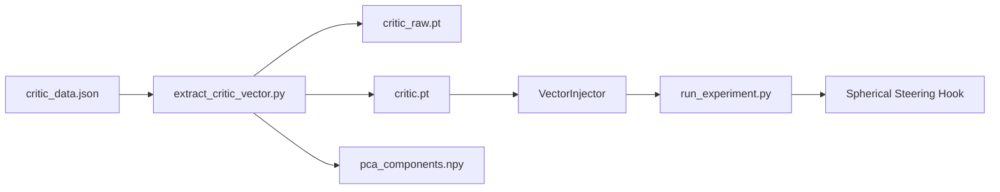

# Walkthrough: Critic Vector Extraction Pipeline

## Changes Made

### 3 new files in `src/`

| File | Purpose |
|------|---------|
| [vector_injector.py](file:///f:/academic/Closed-Loop-Steering-System/src/vector_injector.py) | [VectorInjector](file:///f:/academic/Closed-Loop-Steering-System/src/vector_injector.py#16-157) class — loads, normalizes, serves control vectors for [run_experiment.py](file:///f:/academic/Closed-Loop-Steering-System/src/run_experiment.py) |
| [extract_critic_vector.py](file:///f:/academic/Closed-Loop-Steering-System/src/extract_critic_vector.py) | Standalone CAA extraction script — reads [critic_data.json](file:///f:/academic/Closed-Loop-Steering-System/src/critic_data.json), extracts activations, computes mean-diff vector, PCA-purifies via [ManifoldProjector](file:///f:/academic/Closed-Loop-Steering-System/src/manifold_utils.py#24-92) |
| [test_vector_pipeline.py](file:///f:/academic/Closed-Loop-Steering-System/src/test_vector_pipeline.py) | 7-test verification suite using simulated tensors (no GPU required) |

## Test Results (local, no GPU)

All 7 tests passed:

| Test | Status |
|------|--------|
| Save/Load cycle | ✅ PASS |
| Raw vector fallback | ✅ PASS |
| Missing vector handling | ✅ PASS |
| ManifoldProjector PCA round-trip | ✅ PASS |
| ManifoldProjector save/load components | ✅ PASS |
| Spherical steering integration | ✅ PASS |
| Full pipeline simulation | ✅ PASS |

## Usage: GPU Server Workflow

### Step 1: Extract vectors (on AutoDL GPU server)

```bash
cd /path/to/Closed-Loop-Steering-System/src
python extract_critic_vector.py
```

This will:
1. Load [critic_data.json](file:///f:/academic/Closed-Loop-Steering-System/src/critic_data.json) (100+ prompt pairs)
2. Load Qwen3-8B from `MODEL_PATH` (defined in [config.py](file:///f:/academic/Closed-Loop-Steering-System/src/config.py))
3. For each pair, collect hidden-state activation at layer 24 for both `prompt + pos_completion` and `prompt + neg_completion`
4. Compute raw CAA vector: `v_raw = mean(pos) - mean(neg)`
5. Fit PCA on all collected activations and purify the vector
6. Save 3 output files to `./vectors/qwen3-8b/`:

| Output file | Description |
|-------------|-------------|
| `critic_raw.pt` | Raw CAA vector (shape `[hidden_dim]`) |
| `critic.pt` | PCA-purified + L2-normalized vector |
| `pca_components.npy` | PCA principal components for future use |

### Step 2: Run experiments

```bash
python run_experiment.py
```

[run_experiment.py](file:///f:/academic/Closed-Loop-Steering-System/src/run_experiment.py) will automatically load `critic.pt` via [VectorInjector](file:///f:/academic/Closed-Loop-Steering-System/src/vector_injector.py#16-157) and use it in the spherical steering pipeline.

### Step 3: (Optional) Verify on server

```bash
python test_vector_pipeline.py
```

## Architecture Integration


